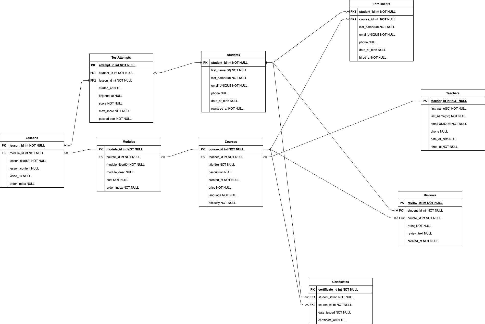

## Тарасов Артём Б22-525
## МИФИ - 2025. Основы безопасности БД.

Платформа онлайн-курсов.

Сущности: студенты, курсы, модули, уроки, преподаватели, сертификаты, отзывы, попытки тестов


Неформальное описание
-- 
Представим компанию **«EduMaster»**, которая предоставляет онлайн-курсы по различным направлениям (программирование, дизайн, маркетинг и пр.). 

- Основная деятельность — создание и управление образовательным контентом, организация обучения студентов и отслеживание их результатов. Система должна позволять:

    - Управлять курсами: каждый курс разбит на модули, а модули — на уроки. Урок может включать видео, текстовые материалы, задания.

    - Назначать преподавателей: у каждого курса есть один или несколько преподавателей. Они ведут уроки, проверяют задания, отвечают на вопросы студентов.

    - Регистрировать студентов: у каждого студента может быть индивидуальный план обучения, набор активных курсов, статистика тестов, полученные сертификаты.

    - Фиксировать попытки прохождения тестов: при прохождении тестов система хранит результаты (баллы, дата, длительность).

    - Выдавать сертификаты: при успешном завершении курса (выполнены все требования) студент получает сертификат.

    - Собирать отзывы: студенты могут оставлять отзывы о курсах.

    - Вести аналитику: учёт успеваемости студентов, статистика по тестам, удовлетворённость и т.п.
----
**Что нужно хранить:**
- Данные о студентах (ФИО, контакты, статистика).
- Данные о преподавателях (ФИО, контактная информация, специализация).
- Структура курсов: курс → модули → уроки.
- История прохождения курсов, результаты тестов.
- Выданные сертификаты.
- Отзывы студентов по курсам.


---
## Спецификация таблиц

Рис 1. Спецификация таблиц


## Доказательство 3НФ


**1NF** (Первая нормальная форма)

1. Каждая таблица имеет атомарные поля (нет нескольких значений в одном столбце).
2. Отсутствуют повторяющиеся группы столбцов типа phone1, phone2, phone3.

**2NF** (Вторая нормальная форма)

1. Все неключевые столбцы зависят от всего первичного ключа, а не от части.

2. Например, в Enrollment первичный ключ составной (student_id, course_id). Не существует зависимостей типа «атрибут зависит только от student_id или только от course_id».

3. Аналогично в других таблицах, где составного ключа нет, всё зависимо от одиночного PK.

**3NF** (Третья нормальная форма)

1. Нет транзитивных зависимостей (т.е. ситуации, когда неключевой атрибут А зависит от атрибута Б, который зависит от ключа).

2. Все неключевые поля зависят только от первичного ключа (не зависят от друг друга). Например, в таблице Course поле title не зависит от teacher_id напрямую, а только от PK course_id.

Пройдёмся также по каждой табличке

1. Students
- PK: student_id
- Все неключевые атрибуты (ФИО, email, дата рождения) зависят только от student_id.
- Нет транзитивных зависимостей.

2. Teachers
- PK: teacher_id
- Все неключевые поля зависят только от teacher_id.
- email уникален, но не влияет на другие поля.

3. Courses
- PK: course_id
- teacher_id — внешний ключ, не определяет другие поля (title, price и т.д.).
- Все неключевые поля зависят только от course_id.

4. Modules
- PK: module_id
- course_id не определяет module_title или order_index.
- Все поля зависят от module_id напрямую.

5. Lessons
- PK: lesson_id
- module_id не определяет lesson_title и т.д.
- Все атрибуты зависят от lesson_id.

6. Enrollments
- PK: составной (student_id, course_id)
- enrolled_at, progress зависят от всей пары, не от части ключа.
- Нет транзитивных зависимостей между неключевыми.

7. TestAttempts
- PK: attempt_id
- Внешние ключи student_id, lesson_id не влияют на score, passed и т.д.
- Все поля зависят от attempt_id.

8. Reviews
- PK: review_id
- student_id, course_id — внешние ключи, не определяют rating и review_text.
- Все поля зависят только от review_id.

9. Certificates
- PK: certificate_id
- student_id, course_id не влияют на date_issued, certificate_url напрямую.
- Все зависят от certificate_id.

### Каждая таблица удовлетворяет 3NF.
---


### Создаем табличку в sqlite3 движке
```bash
~/MEPhi/databases/lab1-1 ❯ sqlite3 lab1-1.db                                                                                                                                           11:43:39
SQLite version 3.43.2 2023-10-10 13:08:14
Enter ".help" for usage hints.
sqlite> .read schema.sql
sqlite> .tables
Certificate  Enrollment   Module       Student      TestAttempt
Course       Lesson       Review       Teacher    
sqlite> .shema Student
Error: unknown command or invalid arguments:  "shema". Enter ".help" for help
sqlite> .schema Student
CREATE TABLE Student (
  student_id     INTEGER PRIMARY KEY,
  first_name     TEXT NOT NULL,
  last_name      TEXT NOT NULL,
  email          TEXT NOT NULL UNIQUE,
  phone          TEXT,
  date_of_birth  TEXT,
  registered_at  TEXT NOT NULL
);
```

### Приложение
```sql

----------------------------------------------------
-- 1. Student
----------------------------------------------------
CREATE TABLE Student (
  student_id     INTEGER PRIMARY KEY,
  first_name     TEXT NOT NULL,
  last_name      TEXT NOT NULL,
  email          TEXT NOT NULL UNIQUE,
  phone          TEXT,
  date_of_birth  TEXT,
  registered_at  TEXT NOT NULL
);

----------------------------------------------------
-- 2. Teacher
----------------------------------------------------
CREATE TABLE Teacher (
  teacher_id     INTEGER PRIMARY KEY,
  first_name     TEXT NOT NULL,
  last_name      TEXT NOT NULL,
  email          TEXT NOT NULL UNIQUE,
  phone          TEXT,
  hired_at       TEXT NOT NULL
);

----------------------------------------------------
-- 3. Course
----------------------------------------------------
CREATE TABLE Course (
  course_id      INTEGER PRIMARY KEY,
  teacher_id     INTEGER NOT NULL,
  title          TEXT NOT NULL,
  description    TEXT,
  created_at     TEXT NOT NULL,
  price          REAL,
  language       TEXT NOT NULL,
  difficulty     TEXT NOT NULL,
  FOREIGN KEY (teacher_id) REFERENCES Teacher(teacher_id)
    ON DELETE CASCADE
    ON UPDATE CASCADE
);

----------------------------------------------------
-- 4. Module
----------------------------------------------------
CREATE TABLE Module (
  module_id      INTEGER PRIMARY KEY,
  course_id      INTEGER NOT NULL,
  module_title   TEXT NOT NULL,
  module_desc    TEXT,
  order_index    INTEGER NOT NULL,
  FOREIGN KEY (course_id) REFERENCES Course(course_id)
    ON DELETE CASCADE
    ON UPDATE CASCADE
);

----------------------------------------------------
-- 5. Lesson
----------------------------------------------------
CREATE TABLE Lesson (
  lesson_id      INTEGER PRIMARY KEY,
  module_id      INTEGER NOT NULL,
  lesson_title   TEXT NOT NULL,
  lesson_content TEXT,
  video_url      TEXT,
  order_index    INTEGER NOT NULL,
  FOREIGN KEY (module_id) REFERENCES Module(module_id)
    ON DELETE CASCADE
    ON UPDATE CASCADE
);

----------------------------------------------------
-- 6. Enrollment (many-to-many между Student и Course)
----------------------------------------------------
CREATE TABLE Enrollment (
  student_id     INTEGER NOT NULL,
  course_id      INTEGER NOT NULL,
  enrolled_at    TEXT NOT NULL,
  progress       REAL DEFAULT 0,
  PRIMARY KEY (student_id, course_id),
  FOREIGN KEY (student_id) REFERENCES Student(student_id)
    ON DELETE CASCADE
    ON UPDATE CASCADE,
  FOREIGN KEY (course_id) REFERENCES Course(course_id)
    ON DELETE CASCADE
    ON UPDATE CASCADE
);

----------------------------------------------------
-- 7. TestAttempt
----------------------------------------------------
CREATE TABLE TestAttempt (
  attempt_id     INTEGER PRIMARY KEY,
  student_id     INTEGER NOT NULL,
  lesson_id      INTEGER NOT NULL,
  started_at     TEXT NOT NULL,
  finished_at    TEXT,
  score          REAL NOT NULL,
  max_score      REAL NOT NULL,
  passed         INTEGER NOT NULL,  -- 1/0, could store bool
  FOREIGN KEY (student_id) REFERENCES Student(student_id)
    ON DELETE CASCADE
    ON UPDATE CASCADE,
  FOREIGN KEY (lesson_id) REFERENCES Lesson(lesson_id)
    ON DELETE CASCADE
    ON UPDATE CASCADE
);

----------------------------------------------------
-- 8. Review
----------------------------------------------------
CREATE TABLE Review (
  review_id     INTEGER PRIMARY KEY,
  student_id    INTEGER NOT NULL,
  course_id     INTEGER NOT NULL,
  rating        REAL NOT NULL,
  review_text   TEXT,
  created_at    TEXT NOT NULL,
  FOREIGN KEY (student_id) REFERENCES Student(student_id)
    ON DELETE CASCADE
    ON UPDATE CASCADE,
  FOREIGN KEY (course_id) REFERENCES Course(course_id)
    ON DELETE CASCADE
    ON UPDATE CASCADE
);

----------------------------------------------------
-- 9. Certificate
----------------------------------------------------
CREATE TABLE Certificate (
  certificate_id  INTEGER PRIMARY KEY,
  student_id      INTEGER NOT NULL,
  course_id       INTEGER NOT NULL,
  date_issued     TEXT NOT NULL,
  certificate_url TEXT,
  FOREIGN KEY (student_id) REFERENCES Student(student_id)
    ON DELETE CASCADE
    ON UPDATE CASCADE,
  FOREIGN KEY (course_id) REFERENCES Course(course_id)
    ON DELETE CASCADE
    ON UPDATE CASCADE
);
```

## Итог

В ходе работы была разработана реляционная модель данных для платформы онлайн-обучения. Построены 9 взаимосвязанных таблиц, каждая из которых приведена к третьей нормальной форме. Создана диаграмма "сущность-связь" (ERD), реализована схема базы данных средствами SQL в системе SQLite3. Полученная структура обеспечивает целостное хранение информации о студентах, курсах, модулях, уроках, тестах, сертификатах, отзывах, что позволяет эффективно решать задачи учёта, аналитики и персонализации образовательного процесса.